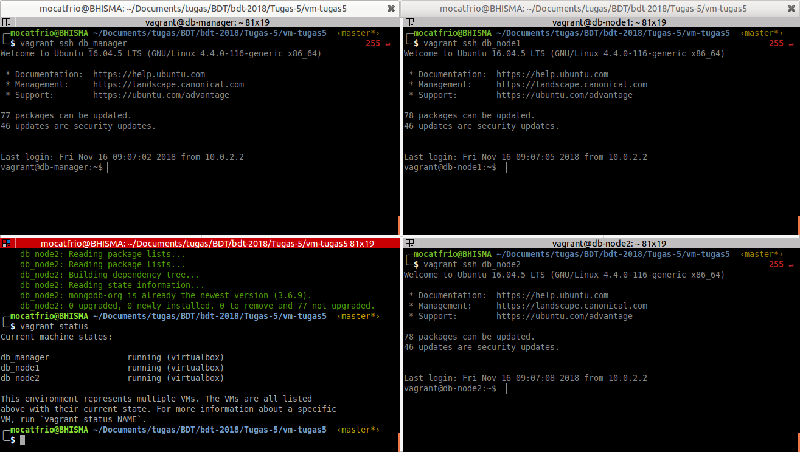
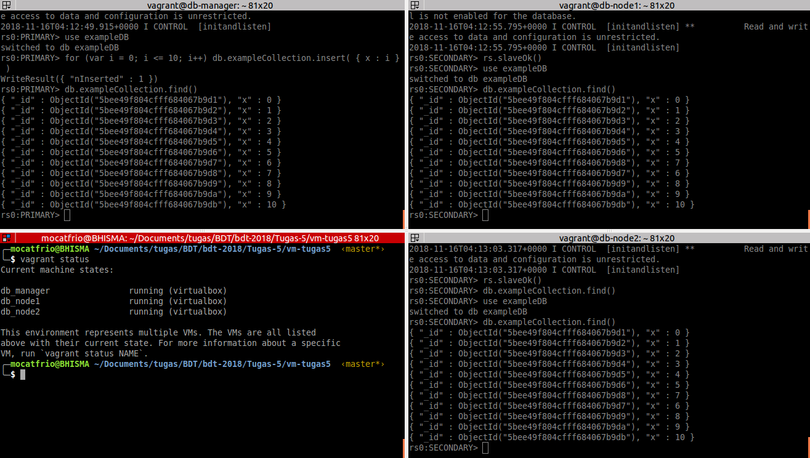

### Basis Data Terdistribusi
# Membuat Aplikasi Web CRUD menggunakan Node.js, MongoDB, dan Vagrant
Oleh: **Hafara Firdausi (05111540000043)**
https://github.com/mocatfrio/bdt-2018/tree/master/Tugas-5

## 1. Deskripsi Tugas
Membuat Aplikasi Web CRUD (Create-Read-Update-Delete) menggunakan Node.js, MongoDB, dan Vagrant.

Langkah yang harus dilakukan:
1. Membuat MongoDB cluster dengan 3 node.
2. Membuat aplikasi web CRUD yang memanfaatkan MongoDB cluster tersebut.
   *  Bahasa pemrograman bebas
   *  Menggunakan konsep OOP.
3. Memilih dataset yang akan dipakai.

## 2. Deskripsi Sistem 

### 2.1 Arsitektur Sistem


Sistem ini diimplementasikan dengan lingkungan virtual, yakni menggunakan teknologi **Vagrant** dan **Virtual Box**.

### 2.2 Dataset
Dataset didownload dari https://github.com/ozlerhakan/mongodb-json-files/blob/master/datasets/catalog.books.json dengan sedikit modifikasi pada bagian **"_id"** dihapus

## 3. Implementasi Sistem
## 3.1 Persiapan
* Lingkungan host : Ubuntu 14.04.5 LTS Trusty
* Teknologi Virtualisasi :
  * Vagrant 2.0.4
  * Virtual Box 5.2.20r125813
* Mendownload [mongodb.zip](https://drive.google.com/file/d/1GuPyLhooMYV-h6In_AW6OB_v52-sIsE4/view) yang telah disediakan oleh dosen, kemudian mengekstraknya (unzip) dengan cara:
  ```bash
  unzip mongodb.zip
  ```

  

## 3.2 Modifikasi Script
Struktur folder Vagrant yang telah dimodifikasi:
```bash
.
├── provision
│   ├── allhosts.sh
│   └── nodejs.sh
├── sources.list
├── Vagrantfile
└── Web
    ├── app.js
    ├── config
    │   └── db.js
    ├── controllers
    │   └── bookController.js
    ├── models
    │   └── book.js
    ├── package.json
    ├── package-lock.json
    ├── public
    │   ├── css
    │   │   ├── all.min.css
    │   │   ├── bootstrap.min.css
    │   │   ├── custom.css
    │   │   └── webfonts
    │   │       ├── fa-brands-400.eot
    │   │       ├── fa-brands-400.svg
    │   │       ├── fa-brands-400.ttf
    │   │       ├── fa-brands-400.woff
    │   │       ├── fa-brands-400.woff2
    │   │       ├── fa-regular-400.eot
    │   │       ├── fa-regular-400.svg
    │   │       ├── fa-regular-400.ttf
    │   │       ├── fa-regular-400.woff
    │   │       ├── fa-regular-400.woff2
    │   │       ├── fa-solid-900.eot
    │   │       ├── fa-solid-900.svg
    │   │       ├── fa-solid-900.ttf
    │   │       ├── fa-solid-900.woff
    │   │       └── fa-solid-900.woff2
    │   ├── img
    │   │   └── brand.png
    │   └── js
    │       ├── all.min.js
    │       └── bootstrap.bundle.min.js
    ├── src
    │   ├── catalog.books.json
    │   └── mongod.conf
    └── views
        ├── book
        │   ├── add-book.ejs
        │   ├── edit-book.ejs
        │   └── list-book.ejs
        ├── components
        │   ├── footer.ejs
        │   ├── head.ejs
        │   └── navbar.ejs
        └── index.ejs
```
1. **Vagrantfile**
   Modifikasi:
    * **bridge** pada `db_manager.vm.network "public_network", bridge: "eth0"` disesuaikan dengan host.
    * **vb.memory** disesuaikan dengan kondisi host supaya tidak lambat.
    * Menambahkan **vm.synced_folder** untuk mensinkronkan folder aplikasi web CRUD NodeJS yang telah dibuat.
    * Menambahkan `db_manager.vm.provision "shell", path: "provision/nodejs.sh", privileged: false` untuk menambahkan provisioning (persiapan) NodeJS khusus pada node **db_manager**.
    * Menambahkan **vm.synced_folder** pada kedua node secondary (**db_node1** dan **db_node2**)
  
    ```ruby
    # -*- mode: ruby -*-
    # vi: set ft=ruby :

    # All Vagrant configuration is done below. The "2" in Vagrant.configure
    # configures the configuration version (we support older styles for
    # backwards compatibility). Please don't change it unless you know what
    # you're doing.

    Vagrant.configure("2") do |config|
      config.vm.define "db_manager" do |db_manager|
        db_manager.vm.hostname = "db-manager"
        db_manager.vm.box = "bento/ubuntu-16.04"
        db_manager.vm.network "private_network", ip: "192.168.33.10"
        db_manager.vm.network "public_network", bridge: "eth0"
        
        db_manager.vm.provider "virtualbox" do |vb|
          vb.name = "db-manager"
          vb.gui = false
          vb.memory = "512"
        end

        db_manager.vm.synced_folder "Web/", "/var/www/project",
          id: "vagrant-root",
          owner: "vagrant",
          group: "www-data",
          mount_options: ["dmode=775,fmode=664"]

        db_manager.vm.provision "shell", path: "provision/allhosts.sh", privileged: false
        db_manager.vm.provision "shell", path: "provision/nodejs.sh", privileged: false
      end

      config.vm.define "db_node1" do |db_node1|
        db_node1.vm.hostname = "db-node1"
        db_node1.vm.box = "bento/ubuntu-16.04"
        db_node1.vm.network "private_network", ip: "192.168.33.11"
        db_node1.vm.network "public_network", bridge: "eth0"
        
        db_node1.vm.provider "virtualbox" do |vb|
          vb.name = "db-node1"
          vb.gui = false
          vb.memory = "512"
        end

        db_node1.vm.synced_folder "Web/src/", "/var/www/project/src",
          id: "vagrant-root",
          owner: "vagrant",
          group: "www-data",
          mount_options: ["dmode=775,fmode=664"]

        db_node1.vm.provision "shell", path: "provision/allhosts.sh", privileged: false
      end

      config.vm.define "db_node2" do |db_node2|
        db_node2.vm.hostname = "db-node2"
        db_node2.vm.box = "bento/ubuntu-16.04"
        db_node2.vm.network "private_network", ip: "192.168.33.12"
        db_node2.vm.network "public_network", bridge: "eth0"
        
        db_node2.vm.provider "virtualbox" do |vb|
          vb.name = "db-node2"
          vb.gui = false
          vb.memory = "512"
        end

        db_node2.vm.synced_folder "Web/src/", "/var/www/project/src",
          id: "vagrant-root",
          owner: "vagrant",
          group: "www-data",
          mount_options: ["dmode=775,fmode=664"]

        db_node2.vm.provision "shell", path: "provision/allhosts.sh", privileged: false
      end

    end
    ```
2. **allhosts.sh**
    ```bash
    # Declare host
    sudo bash -c \\"echo '192.168.33.10 db-manager' >> /etc/hosts\\"
    sudo bash -c \\"echo '192.168.33.11 db-node1' >> /etc/hosts\\"
    sudo bash -c \\"echo '192.168.33.12 db-node2' >> /etc/hosts\\"

    # Copy sources.list
    sudo cp '../sources.list' '/etc/apt/sources.list'

    # Install MongoDB
    # Step 1: Import the MongoDB public key
    sudo apt-key adv --keyserver hkp://keyserver.ubuntu.com:80 --recv 2930ADAE8CAF5059EE73BB4B58712A2291FA4AD5
    # Step 2: Generate a file with the MongoDB repository URL
    sudo bash -c \\"echo 'deb [ arch=amd64,arm64 ] https://repo.mongodb.org/apt/ubuntu xenial/mongodb-org/3.6 multiverse' | sudo tee /etc/apt/sources.list.d/mongodb-org-3.6.list\\"
    # Step 3: Refresh the local database with the packages
    sudo apt-get update
    # Step 4: Install the last stable MongoDB
    sudo apt-get install -y mongodb-org
    # Step 5: Enable MongoDB service
    sudo systemctl enable mongod    
    sudo systemctl start mongod
    # Step 6: Copy mongod.conf
    sudo bash -c \\"sudo cp /var/www/project/src/mongod.conf /etc/mongod.conf\\"
    sudo systemctl restart mongod
    ```
3. **nodejs.sh**
    ```bash
    # Install NodeJS
    # Step 1: Install g++
    sudo apt-get install gcc g++ make
    # Step 2: Download NodeJS + install nodejs dan npm
    curl -sL https://deb.nodesource.com/setup_0.12 | sudo bash -
    sudo apt-get install -y nodejs npm
    # Step 3: NPM install
    cd /var/www/project
    sudo npm install
    # Step 3: Install project manager untuk NodeJS + start pm2
    sudo npm install -g pm2
    sudo bash -c \\"sudo ln -s /usr/bin/nodejs /usr/bin/node\\"
    pm2 start /var/www/project/app.js
    ``` 
4. **mongod.conf**
    Modifikasi:
    * **bindIp** diganti menjadi 0.0.0.0 supaya tidak tetap default 127.0.0.1
    * **replication:** diuncomment dan **replSetName** ditambahkan untuk memberikan nama replika set

    ```bash
    # mongod.conf

    # for documentation of all options, see:
    #   http://docs.mongodb.org/manual/reference/configuration-options/

    # Where and how to store data.
    storage:
      dbPath: /var/lib/mongodb
      journal:
        enabled: true
    #  engine:
    #  mmapv1:
    #  wiredTiger:

    # where to write logging data.
    systemLog:
      destination: file
      logAppend: true
      path: /var/log/mongodb/mongod.log

    # network interfaces
    net:
      port: 27017
      bindIp: 0.0.0.0

    # how the process runs
    processManagement:
      timeZoneInfo: /usr/share/zoneinfo

    #security:

    #operationProfiling:

    replication:
      replSetName: rs0

    #sharding:

    ## Enterprise-Only Options:

    #auditLog:

    #snmp:
    ```
## 3.3 Aplikasi Web CRUD NodeJS

Dapat dilihat di:
[Aplikasi Web CRUD Katalog Buku menggunakan NodeJS](vm-tugas5/Web)

## 3.3 Menjalankan Vagrant
1. Setelah memodifikasi script, maka jalankan vagrant virtual box
   
    ```bash
    vagrant up
    ```
    atau
    ```bash
    vagrant up --provision
    ```
    Ketika menjalankan vagrant, sebenarnya vagrant sedang melakukan provisioning (persiapan dan konfigurasi) menggunakan semua file di atas. Tunggu selama beberapa menit dan pastikan tidak ada error.

2. Cek apakah vagrant sudah berjalan dengan baik.
    ```bash
    vagrant status
    ```

3. Masuk ke dalam semua VM
   
    ```bash
    vagrant ssh db_manager
    vagrant ssh db_node1
    vagrant ssh db_node2
    ```
   


4. Setting MongoDB Replika Set pada **db_manager**. Replika Set adalah sebuah cluster server MongoDB yang mengimplementasikan replikasi master-slave (primary-secondary). Caranya:
    1. Masuk ke dalam shell mongo.
   
        ```bash
        mongo
        ```
    2. Lakukan inisialisasi replika set dengan menambahkan host **db-manager** sebagai member.
   
        ```mongo
        > rs.initiate()
        ```
        Jika keluar output seperti di bawah, maka inisialisasi berhasil.

        ```mongo
        {
          "info2" : "no configuration specified. Using a default configuration for the set",
          "me" : "db-manager:27017",
          "ok" : 1,
          "operationTime" : Timestamp(1542359495, 1),
          "$clusterTime" : {
            "clusterTime" : Timestamp(1542359495, 1),
            "signature" : {
              "hash" : BinData(0,"AAAAAAAAAAAAAAAAAAAAAAAAAAA="),
              "keyId" : NumberLong(0)
            }
          }
        }
        ```
    3. Lanjutkan dengan menambahkan host sisanya.
   
        ```mongo
        rs0:SECONDARY> rs.add('db-node1:27017')
        ```
        Jika keluar output seperti di bawah, maka inisialisasi berhasil.

        ```mongo
        {
          "ok" : 1,
          "operationTime" : Timestamp(1542360364, 1),
          "$clusterTime" : {
            "clusterTime" : Timestamp(1542360364, 1),
            "signature" : {
              "hash" : BinData(0,"AAAAAAAAAAAAAAAAAAAAAAAAAAA="),
              "keyId" : NumberLong(0)
            }
          }
        }
        ```
        dan

        ```mongo
        rs0:PRIMARY> rs.add('db-node2:27017')
        ```

        Jika keluar output seperti di bawah, maka inisialisasi berhasil.

        ```mongo
        {
          "ok" : 1,
          "operationTime" : Timestamp(1542361027, 1),
          "$clusterTime" : {
            "clusterTime" : Timestamp(1542361027, 1),
            "signature" : {
              "hash" : BinData(0,"AAAAAAAAAAAAAAAAAAAAAAAAAAA="),
              "keyId" : NumberLong(0)
            }
          }
        }
        ```
    4. Keluar dari shell mongo.
    5. Test replika set seperti pada web yang ada pada referensi.
   
        

5. Import dataset katalog buku yang telah di download.
    ```bash
    mongoimport --db books --collection books --file /var/www/project/src/catalog.books.json --host=192.168.33.10:27017 --authenticationDatabase admin
    ```
6. Cek pada semua server apakah data **books** telah terimpor dan tereplikasi dengan baik.
    * Cek isi data
  
      
       
    * Cek jumlah data
  
      

## 4. Final Testing
## 5. Referensi
* [MongoDB Cluster Installation](https://medium.com/@ratulbasak93/mongodb-relication-in-ubuntu-16-04-acd5baf744a3)
* [CRUD App with NodeJS and MongoDB](https://codeburst.io/writing-a-crud-app-with-node-js-and-mongodb-e0827cbbdafb)